# Citibike NYC ETL Pipeline

This document describes the **Delta Live Tables (DLT)** pipeline that processes NYC Citibike trip data through the Medallion Architecture.

---

## Architecture Overview

```mermaid
flowchart LR
    subgraph Landing["🗂️ Landing Zone"]
        CSV[("CSV Files<br/>JC-202503-citibike-tripdata.csv")]
    end

    subgraph Bronze["🥉 Bronze Layer"]
        B1["bronze_jc_citibike<br/>Raw data with schema"]
    end

    subgraph Silver["🥈 Silver Layer"]
        S1["silver_jc_citibike<br/>Cleaned & enriched"]
    end

    subgraph Gold["🥇 Gold Layer"]
        G1["gold_daily_ride_summary<br/>Daily aggregates"]
        G2["gold_daily_station_performance<br/>Per-station metrics"]
    end

    CSV --> B1
    B1 --> S1
    S1 --> G1
    S1 --> G2

    style Landing fill:#f9f9f9,stroke:#333
    style Bronze fill:#cd7f32,stroke:#333,color:#fff
    style Silver fill:#c0c0c0,stroke:#333
    style Gold fill:#ffd700,stroke:#333
```



---

## Data Flow Details

### 📊 Input Data Schema

The pipeline ingests Citibike trip data with the following structure:

| Column | Type | Description |
| :--- | :--- | :--- |
| `ride_id` | String | Unique trip identifier |
| `rideable_type` | String | Type of bike (classic, electric) |
| `started_at` | Timestamp | Trip start time |
| `ended_at` | Timestamp | Trip end time |
| `start_station_name` | String | Origin station name |
| `start_station_id` | String | Origin station ID |
| `end_station_name` | String | Destination station name |
| `end_station_id` | String | Destination station ID |
| `start_lat` / `start_lng` | Decimal | Origin coordinates |
| `end_lat` / `end_lng` | Decimal | Destination coordinates |
| `member_casual` | String | Member type (member/casual) |

---

## Layer Transformations

### 🥉 Bronze Layer

**Purpose**: Ingest raw CSV with explicit schema definition.

**File**: [01_bronze_citibike.ipynb](../citibike_etl/dlt/01_bronze/01_bronze_citibike.ipynb)

```python
@dlt.table(comment="Bronze layer: raw Citi Bike data with ingest metadata")
def bronze_jc_citibike():
    df = spark.read.schema(schema).csv(
        f"/Volumes/{catalog}/00_landing/source_citibike_data/JC-202503-citibike-tripdata.csv",
        header=True
    )
    return df
```

**Key Actions**:
- Apply explicit schema (type safety)
- Read from Unity Catalog Volumes
- No transformations (raw data preservation)

---

### 🥈 Silver Layer

**Purpose**: Clean, enrich, and standardize the data.

**File**: [02_silver_citibike.ipynb](../citibike_etl/dlt/02_silver/02_silver_citibike.ipynb)


**Output Columns**:
- `ride_id`, `trip_start_date`, `started_at`, `ended_at`
- `start_station_name`, `end_station_name`
- `trip_duration_mins` (calculated)

---

### 🥇 Gold Layer

**Purpose**: Business-ready aggregations for analytics.

#### 1. Daily Ride Summary

**File**: [03_gold_citibike_daily_ride_summary.ipynb](../citibike_etl/dlt/03_gold/03_gold_citibike_daily_ride_summary.ipynb)

| Metric | Description |
| :--- | :--- |
| `max_trip_duration_mins` | Longest trip of the day |
| `min_trip_duration_mins` | Shortest trip of the day |
| `avg_trip_duration_mins` | Average trip duration |
| `total_trips` | Total number of trips |

#### 2. Daily Station Performance

**File**: [03_gold_citibike_daily_station_performance.ipynb](../citibike_etl/dlt/03_gold/03_gold_citibike_daily_station_performance.ipynb)

| Metric | Description |
| :--- | :--- |
| `avg_trip_duration_mins` | Average duration per station |
| `total_trips` | Trips originating from station |

---

## Technology Stack


| Component | Role |
| :--- | :--- |
| **Delta Live Tables** | Declarative pipeline orchestration |
| **Unity Catalog** | Catalog and governance |
| **Delta Lake** | ACID-compliant storage format |
| **PySpark** | Data transformation engine |

---

## 📁 Project Files

| File | Description |
| :--- | :--- |
| [dlt/01_bronze/01_bronze_citibike.ipynb](../citibike_etl/dlt/01_bronze/01_bronze_citibike.ipynb) | Bronze layer DLT table |
| [dlt/02_silver/02_silver_citibike.ipynb](../citibike_etl/dlt/02_silver/02_silver_citibike.ipynb) | Silver layer DLT table |
| [dlt/03_gold/03_gold_citibike_daily_ride_summary.ipynb](../citibike_etl/dlt/03_gold/03_gold_citibike_daily_ride_summary.ipynb) | Daily aggregates |
| [dlt/03_gold/03_gold_citibike_daily_station_performance.ipynb](../citibike_etl/dlt/03_gold/03_gold_citibike_daily_station_performance.ipynb) | Station metrics |

---

## Running the Pipeline

```bash
# Deploy the DLT pipeline
databricks bundle deploy --target dev

# Run the pipeline
databricks bundle run citibike_dlt_pipeline --target dev
```

---

## Additional Resources

- [Delta Live Tables Documentation](https://docs.databricks.com/en/delta-live-tables/index.html)
- [Medallion Architecture](https://www.databricks.com/glossary/medallion-architecture)
