# Formula 1 ETL Pipeline

This document describes the ETL pipeline that processes historical Formula 1 racing data through the Medallion Architecture using PySpark notebooks.

---

## Architecture Overview

```mermaid
flowchart LR
    subgraph Landing["🗂️ Landing Zone"]
        L1[("CSV Files")]
        L2[("JSON Files")]
    end

    subgraph Bronze["🥉 Bronze Layer"]
        B1["circuits"]
        B2["races"]
        B3["constructors"]
        B4["drivers"]
        B5["results"]
        B6["pit_stops"]
        B7["lap_times"]
        B8["qualifying"]
    end

    subgraph Silver["🥈 Silver Layer"]
        S1["circuits"]
        S2["races"]
        S3["constructors"]
        S4["drivers"]
        S5["results"]
        S6["pit_stops"]
        S7["lap_times"]
        S8["qualifying"]
    end

    L1 --> B1 & B2 & B3 & B4
    L2 --> B5 & B6 & B7 & B8
    
    B1 --> S1
    B2 --> S2
    B3 --> S3
    B4 --> S4
    B5 --> S5
    B6 --> S6
    B7 --> S7
    B8 --> S8

    style Landing fill:#f9f9f9,stroke:#333
    style Bronze fill:#cd7f32,stroke:#333,color:#fff
    style Silver fill:#c0c0c0,stroke:#333
```



---

## Data Sources

The pipeline processes 8 distinct data sources covering 70+ years of Formula 1 racing:

| Data Source | Format | Description |
| :--- | :--- | :--- |
| **circuits** | CSV | Racing circuit locations and metadata |
| **races** | CSV | Race events by season |
| **constructors** | JSON | Team/constructor information |
| **drivers** | JSON | Driver profiles and nationalities |
| **results** | JSON | Race results and standings |
| **pit_stops** | JSON | Pit stop timing data |
| **lap_times** | CSV | Individual lap timing records |
| **qualifying** | JSON | Qualifying session results |

---

## Data Flow Architecture

```mermaid
flowchart TB
    subgraph Storage["Storage Layers"]
        direction TB
        L["📥 /mnt/gualterformula1dl/landing<br/>Original CSV/JSON files"]
        R["🥉 /mnt/gualterformula1dl/raw<br/>Parquet (Bronze)"]
        P["🥈 /mnt/gualterformula1dl/processed<br/>Parquet (Silver)"]
        PR["🥇 /mnt/gualterformula1dl/presentation<br/>Parquet (Gold)"]
    end
    
    L --> R --> P --> PR
```



---

## Layer Details

### 🥉 Bronze Layer (Raw)

**Purpose**: Ingest source files with minimal transformation, convert to Parquet, add ingestion metadata.

**Location**: `/mnt/gualterformula1dl/raw/`

**Notebooks**: [formula_1_etl/notebooks/01_bronze/](../formula_1_etl/notebooks/01_bronze/)


**Example - circuits.csv**:

```python
# Read with explicit schema
circuits_df = spark.read \
    .option("header", True) \
    .schema(circuits_schema) \
    .csv(f"{landing_folder_path}/circuits.csv")

# Add metadata
circuits_df = circuits_df \
    .withColumn("ingestion_date", current_timestamp()) \
    .withColumn("data_source", lit(v_data_source))

# Write to bronze
circuits_df.write.mode("overwrite").parquet(f"{raw_folder_path}/circuits")
```

---

### 🥈 Silver Layer (Processed)

**Purpose**: Clean, transform, and standardize data for analytics consumption.

**Location**: `/mnt/gualterformula1dl/processed/`

**Notebooks**: [formula_1_etl/notebooks/02_silver/](../formula_1_etl/notebooks/02_silver/)


**Transformations Applied**:

| Transformation | Example |
| :--- | :--- |
| Column Selection | Remove `url` column |
| Column Renaming | `circuitId` → `circuit_id` |
| Type Standardization | `lat` → `latitude` (Double) |
| Metadata Addition | `ingestion_date`, `data_source` |

---

## Data Entity Relationships


---

## Notebook Inventory

### Bronze Layer Notebooks

| Notebook | Source File | Output |
| :--- | :--- | :--- |
| [1.bronze_circuits.ipynb](../formula_1_etl/notebooks/01_bronze/1.bronze_circuits.ipynb) | circuits.csv | raw/circuits/ |
| [2.bronze_races.ipynb](../formula_1_etl/notebooks/01_bronze/2.bronze_races.ipynb) | races.csv | raw/races/ |
| [3.bronze_constructors.ipynb](../formula_1_etl/notebooks/01_bronze/3.bronze_constructors.ipynb) | constructors.json | raw/constructors/ |
| [4.bronze_drivers.ipynb](../formula_1_etl/notebooks/01_bronze/4.bronze_drivers.ipynb) | drivers.json | raw/drivers/ |
| [5.bronze_results.ipynb](../formula_1_etl/notebooks/01_bronze/5.bronze_results.ipynb) | results.json | raw/results/ |
| [6.bronze_pit_stops.ipynb](../formula_1_etl/notebooks/01_bronze/6.bronze_pit_stops.ipynb) | pit_stops.json | raw/pit_stops/ |
| [7.bronze_lap_times.ipynb](../formula_1_etl/notebooks/01_bronze/7.bronze_lap_times.ipynb) | lap_times/*.csv | raw/lap_times/ |
| [8.bronze_qualifying.ipynb](../formula_1_etl/notebooks/01_bronze/8.bronze_qualifying.ipynb) | qualifying.json | raw/qualifying/ |

### Silver Layer Notebooks

| Notebook | Input | Output |
| :--- | :--- | :--- |
| [1.ingest_circuits_file.ipynb](../formula_1_etl/notebooks/02_silver/1.ingest_circuits_file.ipynb) | raw/circuits/ | processed/circuits/ |
| [2.ingest_races_file.ipynb](../formula_1_etl/notebooks/02_silver/2.ingest_races_file.ipynb) | raw/races/ | processed/races/ |
| [3.ingest_constructors_file.ipynb](../formula_1_etl/notebooks/02_silver/3.ingest_constructors_file.ipynb) | raw/constructors/ | processed/constructors/ |
| [4.ingest_drivers_file.ipynb](../formula_1_etl/notebooks/02_silver/4.ingest_drivers_file.ipynb) | raw/drivers/ | processed/drivers/ |
| [5.ingest_results_file.ipynb](../formula_1_etl/notebooks/02_silver/5.ingest_results_file.ipynb) | raw/results/ | processed/results/ |
| [6.ingest_pit_stops_file.ipynb](../formula_1_etl/notebooks/02_silver/6.ingest_pit_stops_file.ipynb) | raw/pit_stops/ | processed/pit_stops/ |
| [7.ingest_lap_times_file.ipynb](../formula_1_etl/notebooks/02_silver/7.ingest_lap_times_file.ipynb) | raw/lap_times/ | processed/lap_times/ |
| [8.ingest_qualifying_file.ipynb](../formula_1_etl/notebooks/02_silver/8.ingest_qualifying_file.ipynb) | raw/qualifying/ | processed/qualifying/ |

---

## Shared Utilities

Located in [src/formula1/](../src/formula1/):

### Constants ([formula1_constants.py](../src/formula1/formula1_constants.py))

```python
landing_folder_path = "/mnt/gualterformula1dl/landing"
raw_folder_path = "/mnt/gualterformula1dl/raw"          # Bronze
processed_folder_path = "/mnt/gualterformula1dl/processed"  # Silver
presentation_folder_path = "/mnt/gualterformula1dl/presentation"  # Gold
```

### Utility Functions ([formula1_utils.py](../src/formula1/formula1_utils.py))

| Function | Description |
| :--- | :--- |
| `add_ingestion_date(df)` | Adds `ingestion_date` column with current timestamp |
| `re_arrange_partition_column(df, col)` | Moves partition column to end of schema |
| `overwrite_partition(df, db, table, col)` | Dynamic partition overwrite for incremental loads |
| `df_column_to_list(df, col)` | Extracts distinct column values to Python list |

---

## Running the Pipeline

### Orchestration Notebook

Use [0.ingest_all_to_bronze.ipynb](../formula_1_etl/notebooks/01_bronze/0.ingest_all_to_bronze.ipynb) to run all bronze ingestions:

```python
# Runs all 8 bronze notebooks sequentially
dbutils.notebook.run("./1.bronze_circuits", 0, {"p_data_source": "ergast"})
dbutils.notebook.run("./2.bronze_races", 0, {"p_data_source": "ergast"})
# ... continues for all data sources
```

### Using Databricks Asset Bundles

```bash
# Deploy resources
databricks bundle deploy --target dev

# Run ingestion job
databricks bundle run formula1_ingestion_job --target dev
```

---

## Data Quality Considerations


| Practice | Implementation |
| :--- | :--- |
| **Schema Enforcement** | Explicit StructType definitions |
| **Null Handling** | `nullable=True/False` per field |
| **Lineage Tracking** | `data_source` parameter via widgets |
| **Audit Trail** | `ingestion_date` timestamp |

---

## Additional Resources

- [Ergast Developer API](http://ergast.com/mrd/) - Source data
- [Medallion Architecture](https://www.databricks.com/glossary/medallion-architecture)
- [PySpark Documentation](https://spark.apache.org/docs/latest/api/python/)
